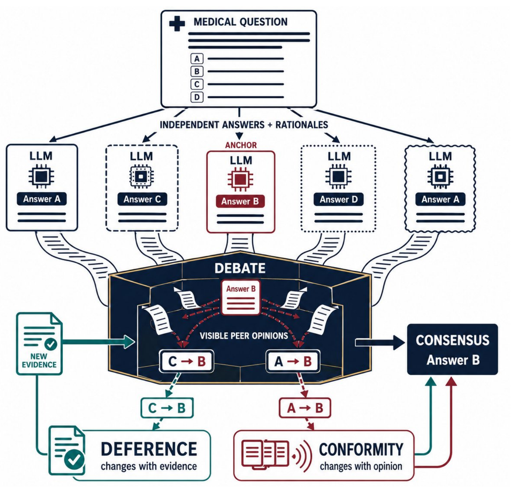

<div align="center">
  
  <br><br>
  <h1>Too Many Cooks Spoil The Broth</h1>
  <p><strong>Auditing Multi-Agent LLM Councils For Medical Reasoning</strong></p>
  <p>Complete, question-level transcripts from a multi-agent medical reasoning council.</p>

  <p>
    
    
    
    
    
  </p>

  <p>
    
  </p>
  <p><strong>EMNLP 2026 · Main Conference</strong></p>
  <p>
    <a href="transcripts/"><strong>Explore transcripts</strong></a>
    &nbsp;·&nbsp;
    <a href="prompts/"><strong>View prompt templates</strong></a>
    &nbsp;·&nbsp;
    <a href="assets/council-debate-framework.pdf"><strong>Open framework figure</strong></a>
  </p>
</div>

<p align="center">
  <strong>Corresponding Author: Prof. Dr. Kshitij Jadhav</strong><br>
  <strong>Principal Investigator, AIDE Lab, and Assistant Professor, Koita Centre for Digital Health (KCDH), IIT Bombay</strong>
</p>

<p align="center">
  <a href="assets/council-debate-framework.pdf">
    
  </a>
</p>

<p align="center"><em>
  The council begins with independent answers, exposes members to peer rationales,
  and tracks whether convergence reflects new evidence or social conformity.
  Select the figure to open the original PDF.
</em></p>

<p align="center">
  <strong>Conditional resolution path</strong>
  <br><br>
  
  &nbsp;&rarr;&nbsp;
  
  &nbsp;&rarr;&nbsp;
  
  &nbsp;&rarr;&nbsp;
  
</p>

---

## Overview

This repository accompanies the paper *Too Many Cooks Spoil The Broth: Auditing
Multi-Agent LLM Councils For Medical Reasoning*. It provides full per-question
debate transcripts from a five-member council of open-weight medical LLMs across
six medical question-answering benchmarks, together with the exact prompt
templates used to produce them.

The release contains **all 8,402 questions** from the run: every independent
Round-0 answer, every debate round that fired, every escalation to the larger
Panel-2, the vote tallies at each step, and the final verdict with the rule that
produced it. Nothing is subsampled and nothing is anonymised.

| Start here | What you will find |
|---|---|
| [Dataset composition](#dataset-composition) | Counts across resolution paths and benchmarks |
| [Model panels](#model-panels) | The five-member council and three-member escalation panel |
| [Resolution protocol](#resolution-protocol) | Consensus, debate, escalation, and weighted-majority rules |
| [Transcript structure](#transcript-structure) | A shortened but faithful example record |
| [Field reference](#field-reference) | Definitions for every released JSON field |
| [Load the data](#load-the-data) | Minimal Python examples |
| [Prompt templates](#prompt-templates) | Verbatim prompts used at every stage |
| [Data notes](#data-notes-and-known-artefacts) | Parsing, prompting, and run-time artefacts to consider |

## Repository contents

```
.
├── README.md
├── assets/
│   ├── aide-lab-logo.png               AIDE Lab mark used in this page
│   ├── council-debate-framework.png    preview of the council framework
│   └── council-debate-framework.pdf    original publication-quality figure
├── prompts/
│   ├── round_0_independent.txt          the independent-answer prompt
│   ├── debate_round.txt                 the per-member debate prompt, Rounds 1-3
│   └── panel_2_escalation.txt           the Panel-2 escalation prompt
└── transcripts/
    ├── 01_early_consensus/
    ├── 02_debate_1_round/
    ├── 03_debate_2_rounds/
    ├── 04_debate_3_rounds/
    ├── 05_escalated_panel2_consensus/
    ├── 06_escalated_panel2_no_consensus/
    └── 07_no_consensus_no_escalation/
```

One question is one JSON file. Files are grouped first by **resolution path**
(the outer folder) and then by **benchmark** (the inner folder), and are named
after the question they came from:

```
transcripts/02_debate_1_round/medqa/medqa-36.json
transcripts/01_early_consensus/mmlu/mmlu-1074.json
transcripts/05_escalated_panel2_consensus/medxpertqa/medxpertqa-Text-118.json
```

The filename carries the source benchmark and that benchmark's own question
identifier, so any transcript can be joined straight back to the row it came
from.

## Dataset composition

| Category | mmlu | medqa | metamed | pubmedqa | pubmedqa_context | medxpertqa | Total |
|---|---|---|---|---|---|---|---|
| `01_early_consensus` | 852 | 1008 | 910 | 840 | 895 | 1151 | 5656 |
| `02_debate_1_round` | 196 | 329 | 304 | 110 | 81 | 764 | 1784 |
| `03_debate_2_rounds` | 30 | 94 | 90 | 26 | 10 | 271 | 521 |
| `04_debate_3_rounds` | 6 | 30 | 36 | 13 | 3 | 130 | 218 |
| `05_escalated_panel2_consensus` | 4 | 37 | 0 | 6 | 5 | 108 | 160 |
| `06_escalated_panel2_no_consensus` | 1 | 2 | 0 | 0 | 1 | 26 | 30 |
| `07_no_consensus_no_escalation` | 0 | 0 | 33 | 0 | 0 | 0 | 33 |
| **Total** | **1,089** | **1,500** | **1,373** | **995** | **995** | **2,450** | **8,402** |

| Folder | Meaning |
|---|---|
| `01_early_consensus` | Resolved at Round 0. No debate fired. |
| `02_debate_1_round` | Resolved at the end of debate Round 1. |
| `03_debate_2_rounds` | Resolved at the end of debate Round 2. |
| `04_debate_3_rounds` | Resolved at the end of debate Round 3. |
| `05_escalated_panel2_consensus` | Three rounds without convergence, escalated, Panel-2 converged. |
| `06_escalated_panel2_no_consensus` | Escalated and Panel-2 also failed to converge; resolved by weighted majority. |
| `07_no_consensus_no_escalation` | Three rounds without convergence and Panel-2 was not run; resolved by weighted majority over the Panel-1 final-round votes alone. |

Category `07` exists only because Panel-2 was not executed for the MetaMedQA
questions that exhausted their debate rounds. All 33 records in it are MetaMedQA,
their `escalated` flag is `false` and their `panel_2` block is `null`. They are
kept in their own folder rather than filed under `04_debate_3_rounds`, which is
reserved for questions that actually converged at Round 3.

The six benchmarks are MMLU-Med, MedQA, MetaMedQA, PubMedQA without context,
PubMedQA with context, and MedXpertQA, with 4, 5, 6, 3, 3 and 10 answer options
respectively.

## Model panels

Every response in every transcript is keyed by the model that produced it. The
`model_key` is the dictionary key inside the JSON; `model_name` is the display
name carried alongside each response. Both are reproduced below exactly as the
pipeline recorded them, including the lower-case final character of the display
names — those are the literal strings the run wrote, and the same strings Panel-2
saw in the Panel-1 summary, so they are left untouched rather than tidied.

### Panel 1: the council

Five open-weight medical or generalist models in the 4-8B range, listed in the
fixed order used throughout the run. That order matters: it determines the
Panelist A-D labels in the debate prompt.

| # | `model_key` | `model_name` | Hugging Face identifier |
|---|---|---|---|
| 1 | `medgemma_4b` | MedGemma-4b | `google/medgemma-4b-it` |
| 2 | `rnj1_8b` | Rnj1-8b | `EssentialAI/rnj-1-instruct` |
| 3 | `qwen3_vl_8b` | Qwen3-VL-8b | `Qwen/Qwen3-VL-8B-Instruct` |
| 4 | `openbio_8b` | OpenBioLLM-8b | `aaditya/Llama3-OpenBioLLM-8B` |
| 5 | `olmo3_7b` | Olmo3-7b | `allenai/Olmo-3-7B-Instruct` |

### Panel 2: the escalation panel

Three larger models, 20-32B, invoked only when Panel-1 exhausts its debate rounds
without converging. Each answers independently; there is no debate among Panel-2
members in this release.

| # | `model_key` | `model_name` | Hugging Face identifier |
|---|---|---|---|
| 1 | `gpt_oss_20b` | GPT-OSS-20b | `openai/gpt-oss-20b` |
| 2 | `medgemma_27b` | MedGemma-27b | `google/medgemma-27b-it` |
| 3 | `qwen3_vl_32b` | Qwen3-VL-32b | `Qwen/Qwen3-VL-32B-Instruct` |

### Decoding

All eight models were run with greedy decoding, `max_new_tokens = 1024` and
`dtype = bfloat16`, with no per-model override anywhere. Greedy decoding was
achieved by `do_sample = False`; no temperature was passed to the generation call,
so the `temperature: 0.0` line in the run configuration is inert rather than
applied. The generation cap was reached exactly and never exceeded: the maximum
`generated_tokens` over every response in this release is 1024.

Three of the eight models carried a model-specific system message in addition to
the shared prompt:

- `medgemma_4b` — "You are a helpful medical assistant."
- `medgemma_27b` — "You are a helpful medical assistant."
- `openbio_8b` — "You are an expert and experienced from the healthcare and biomedical domain with extensive medical knowledge and practical experience."

The other five models were run with no system message. Each model's own chat
template was applied on top of the prompt text before generation.

## Resolution protocol

These are the rules the run actually applied, and they are what the folder name
and the `verdict_method` field record.

1. **Round 0.** All five council members answer independently. Their
   `selected_option` values are tallied. If the modal option holds **at least 3
   votes**, it is returned immediately as the council's answer
   (`panel_1_early_consensus`) and no debate round fires.

   The threshold is an absolute count of 3, not a ratio, and it is counted over
   *parsed* votes only. A member whose output could not be parsed into a valid
   option contributes no vote, so a question where one member failed to parse can
   reach the threshold on 3 of 4 votes. The `agreement_ratio` field records the
   modal share of parsed votes and therefore takes values such as 0.75 (3 of 4)
   as well as 0.6 (3 of 5).

2. **Debate.** Otherwise the council runs up to three debate rounds. In each
   round every member is given a fresh single-turn prompt containing its own
   previous answer, the other four members' previous answers (labelled Panelist
   A-D), and the running vote tally. The same 3-vote threshold is tested at the
   end of each round; the first round that clears it ends the debate
   (`panel_1_debate_consensus`).

3. **Escalation.** A question that completes three debate rounds without clearing
   the threshold escalates to Panel-2. The three specialists answer
   independently, having been shown a summary of the Panel-1 discussion. If at
   least 2 of 3 agree, that option is the answer (`panel_2_consensus`).

4. **Weighted majority.** If Panel-2 also fails to converge, each Panel-1
   final-round vote counts 1 and each Panel-2 vote counts 2; the highest-scoring
   option is returned (`weighted_majority`).

## Transcript structure

Abbreviated from the real record
[`transcripts/02_debate_1_round/medqa/medqa-36.json`](transcripts/02_debate_1_round/medqa/medqa-36.json):
only one of the five responses is shown per round, the five options are cut to
two, and the long text fields are truncated. Every value that does appear is
exactly as it appears on disk. Note that `correct_option` is `"E"`, an option
trimmed out of this excerpt but present in the real file.

```json
{
  "sample_id": "medqa-36",
  "dataset": "medqa",
  "question_id": "36",
  "category": "02_debate_1_round",
  "question": {
    "text": "A 74-year-old man with a history of encephalomyelitis, ataxia, and nystagmus a new diagnosis of small cell carcinoma of the lung (T2, N1, Mn/a) is adm ...",
    "options": {
      "A": "Anti-Yo",
      "B": "Anti-amphiphysin"
    },
    "context": "",
    "correct_option": "E",
    "metadata": {
      "meta_info": "step1"
    }
  },
  "panel_1": [
    "medgemma_4b",
    "rnj1_8b",
    "qwen3_vl_8b",
    "openbio_8b",
    "olmo3_7b"
  ],
  "rounds": [
    {
      "round": 0,
      "kind": "independent",
      "responses": {
        "medgemma_4b": {
          "model_name": "MedGemma-4b",
          "selected_option": "E",
          "confidence": 0.95,
          "clinical_reasoning": "The patient's presentation of optic neuritis and uveitis, along with a history of encephalomyelitis, ataxia, and nystagm ...",
          "critical_evidence": "The combination of small cell lung cancer and optic neuritis/uveitis is highly suggestive ...",
          "differential_considered": "Anti-Yo is associated with ovarian and breast cancer, not typically small cell lung cancer ...",
          "usage": {
            "prompt_tokens": 366,
            "generated_tokens": 289,
            "generation_time_s": 14.91
          }
        }
      },
      "vote_distribution": {
        "E": 2,
        "B": 1,
        "C": 1,
        "A": 1
      },
      "agreement_ratio": 0.4,
      "position_changes": []
    },
    {
      "round": 1,
      "kind": "debate",
      "responses": {
        "rnj1_8b": {
          "model_name": "Rnj1-8b",
          "selected_option": "E",
          "confidence": 0.95,
          "changed_position": true,
          "clinical_reasoning": "",
          "reasoning_update": "Upon reviewing the colleagues' arguments, I recognize that while amphiphysin autoantibodies (B) are associated with opti ...",
          "critical_evidence": "The combination of encephalomyelitis, ataxia, nystagmus, and optic neuritis/uveitis in the ...",
          "counter_argument": "While amphiphysin autoantibodies can cause optic neuritis, the broader neurological involv ...",
          "usage": {
            "prompt_tokens": 1132,
            "generated_tokens": 1024,
            "generation_time_s": 46.648
          }
        }
      },
      "vote_distribution": {
        "E": 4,
        "B": 1
      },
      "agreement_ratio": 0.8,
      "position_changes": [
        {
          "model": "rnj1_8b",
          "model_name": "Rnj1-8b",
          "from": "B",
          "to": "E"
        },
        {
          "model": "qwen3_vl_8b",
          "model_name": "Qwen3-VL-8b",
          "from": "C",
          "to": "B"
        },
        {
          "model": "olmo3_7b",
          "model_name": "Olmo3-7b",
          "from": "A",
          "to": "E"
        }
      ]
    }
  ],
  "panel_2": null,
  "final": {
    "selected_option": "E",
    "correct_option": "E",
    "is_correct": true,
    "verdict_method": "panel_1_debate_consensus",
    "n_debate_rounds": 1,
    "escalated": false
  }
}
```

## Field reference

### Top level

| Field | Type | Description |
|---|---|---|
| `sample_id` | string | `<dataset>-<question_id>`. Unique across the release, and identical to the filename stem. |
| `dataset` | string | One of `mmlu`, `medqa`, `metamed`, `pubmedqa`, `pubmedqa_context`, `medxpertqa`. |
| `question_id` | string | The identifier in the source benchmark, so a record can be joined back to it. |
| `category` | string | Resolution path; identical to the containing category folder. |
| `question` | object | The question as presented to every model. |
| `panel_1` | array of string | The five council `model_key`s, in fixed panel order. |
| `rounds` | array of object | Round 0 followed by each debate round that fired. |
| `panel_2` | object or null | The escalation panel block; `null` unless the question escalated. |
| `final` | object | The council's final answer and how it was reached. |

### `question`

| Field | Type | Description |
|---|---|---|
| `text` | string | The case or question stem, verbatim from the benchmark. |
| `options` | object | Letter to option text. |
| `context` | string | The abstract shown to the models for `pubmedqa_context`. Empty string for every other dataset. |
| `correct_option` | string | The benchmark's gold letter. |
| `metadata` | object | Whatever the source benchmark carries: `subject` (MMLU-Med), `meta_info` (MedQA, MetaMedQA), `kind` (MetaMedQA), `medical_task` / `body_system` / `question_type` (MedXpertQA). Empty for PubMedQA. |

### `rounds[i]`

`rounds[0]` is always present and is the independent round. `rounds[1..3]` are
debate rounds and exist only if debate fired.

| Field | Type | Description |
|---|---|---|
| `round` | int | `0` for the independent round, `1`-`3` for debate rounds. |
| `kind` | string | `"independent"` or `"debate"`. |
| `responses` | object | `model_key` to response object. A model whose output could not be parsed at all may be absent. |
| `vote_distribution` | object | Option to vote count at the close of this round, counting only non-null selections. |
| `agreement_ratio` | float | `max(vote_distribution) / sum(vote_distribution)`. The denominator is the number of *parsed* votes, not always 5. |
| `position_changes` | array of object | `{model, model_name, from, to}` for each member who moved this round. Always `[]` at Round 0. |

#### Response object, `kind = "independent"`

| Field | Type | Description |
|---|---|---|
| `model_name` | string | Display name of the responding model. |
| `selected_option` | string or null | The chosen letter. `null` when the response could not be parsed into a valid option; such a response casts no vote. |
| `confidence` | float | The model's self-reported confidence in [0, 1]. No consensus rule reads this field. |
| `clinical_reasoning` | string | Step-by-step reasoning, as requested by the prompt. |
| `critical_evidence` | string | The single finding the model named as decisive. |
| `differential_considered` | string | Differentials the model says it ruled out. |
| `usage` | object | `prompt_tokens`, `generated_tokens`, `generation_time_s`. |

#### Response object, `kind = "debate"`

| Field | Type | Description |
|---|---|---|
| `model_name` | string | Display name of the responding model. |
| `selected_option` | string or null | The option held at the end of this round. |
| `confidence` | float | Updated self-reported confidence. |
| `changed_position` | bool | Whether this member moved relative to the previous round. |
| `clinical_reasoning` | string | Present in the debate response format but rarely populated: 1,442 of the debate responses here carry one. It is a distinct field from `reasoning_update` and is the field the debate prompt reads when it renders a colleague's `Reasoning:` line, which is why that line is usually blank from Round 2 onward. |
| `reasoning_update` | string | What moved the member, or why it held firm. |
| `critical_evidence` | string | Strongest evidence for the position now held. |
| `counter_argument` | string | Rebuttal to the strongest opposing argument. |
| `usage` | object | `prompt_tokens`, `generated_tokens`, `generation_time_s`. |

### `panel_2`

Present only for the two escalated categories; `null` everywhere else.

| Field | Type | Description |
|---|---|---|
| `members` | array of string | The three Panel-2 `model_key`s. |
| `responses` | object | `model_key` to Panel-2 response object. |
| `vote_distribution` | object | Option to vote count across the three specialists. |
| `agreement_ratio` | float | Modal share of the parsed Panel-2 votes. |
| `consensus_reached` | bool | Whether at least two specialists agreed. |

#### Panel-2 response object

| Field | Type | Description |
|---|---|---|
| `model_name` | string | Display name of the responding model. |
| `selected_option` | string or null | The specialist's option. |
| `confidence` | float | Self-reported confidence in [0, 1]. |
| `clinical_reasoning` | string | The specialist's reasoning. |
| `critical_evidence` | string | The finding named as decisive. |
| `panel1_assessment` | string | The specialist's read on where Panel-1 went right or wrong. |
| `differential_considered` | string | Differentials the specialist considered. |
| `usage` | object | `prompt_tokens`, `generated_tokens`, `generation_time_s`. |

### `final`

| Field | Type | Description |
|---|---|---|
| `selected_option` | string | The council's answer. Never null in this release: every question resolved to an option. |
| `correct_option` | string | Repeated from `question.correct_option` for convenience. |
| `is_correct` | bool | `selected_option == correct_option`. |
| `verdict_method` | string | `panel_1_early_consensus`, `panel_1_debate_consensus`, `panel_2_consensus`, or `weighted_majority`. |
| `n_debate_rounds` | int | Number of debate rounds that fired, 0 to 3. |
| `escalated` | bool | Whether the question reached Panel-2. |

## Load the data

```python
import glob, json

records = [json.load(open(p)) for p in glob.glob("transcripts/*/*/*.json")]
assert len(records) == 8402

# one resolution path
three_round = [json.load(open(p))
               for p in glob.glob("transcripts/04_debate_3_rounds/*/*.json")]

# one benchmark
medqa = [json.load(open(p)) for p in glob.glob("transcripts/*/medqa/*.json")]

# one question
r = json.load(open("transcripts/02_debate_1_round/medqa/medqa-36.json"))
```

## Prompt templates

The three files in [`prompts/`](prompts/) are the verbatim templates used at each
stage, with their placeholders documented and notes on how the surrounding text
was assembled: how colleague responses were labelled and ordered, what the
Round-2 summary block contained, and what the Panel-1 summary shown to Panel-2
looked like. Read them alongside the transcripts before drawing conclusions about
what any model could see when it answered.

## Data notes and known artefacts

The transcripts are the run as it executed, not a cleaned-up idealisation. These
are preserved deliberately, and they matter for any re-analysis.

- **Unparsed responses.** Some model outputs were prose, or JSON truncated at the
  1024-token generation limit. Where the option letter could not be recovered,
  `selected_option` is `null` and the response casts no vote. Text fields hold
  whatever was recovered.
- **Deterministic Panelist labels.** The Panelist A-D labels in the debate prompt
  are assigned by fixed panel order with the recipient removed, not shuffled per
  question. The mapping is stable for a given recipient across all questions and
  rounds. See note 1 of [`prompts/debate_round.txt`](prompts/debate_round.txt).
- **Empty reasoning lines from Round 2 onward.** The debate prompt renders each
  colleague's `Reasoning:` line, and the recipient's own `Your reasoning:` line,
  from `clinical_reasoning` — a field that debate-format responses usually do not
  carry. Measured over the colleague blocks actually rendered, that line is empty
  in 91.9% of them at Round 2 and 91.8% at Round 3. Only OpenBioLLM-8b and
  Olmo3-7b ever populate it; MedGemma-4b, Rnj1-8b and Qwen3-VL-8b never do. From
  Round 2 on, the argument content a member could actually see is carried by the
  `Key Evidence:` lines and the summary block. See note 4 of
  [`prompts/debate_round.txt`](prompts/debate_round.txt).
- **Panel-1 identities visible to Panel-2.** The Panel-1 summary shown to the
  escalation panel names the council models explicitly, unlike the Panel-1 debate
  prompt, which anonymises them as Panelist A-D. See note 1 of
  [`prompts/panel_2_escalation.txt`](prompts/panel_2_escalation.txt).
- **`medqa-51` was run three times.** Its source state file holds nine debate
  blocks: rounds 1-3, repeated three times, from three independent re-executions.
  The three passes agree on every vote distribution, agreement ratio and position
  change, but **not** on the generated text — rationales, self-reported confidences
  and token counts differ between passes, so the run is not bit-wise reproducible
  here despite greedy decoding. This release keeps the **first** pass and drops the
  other two; the discarded responses are not represented anywhere in these files.
  It is the only question in the release affected, and the only one whose round
  blocks needed collapsing.
- **Not every requested field was answered.** The models were asked for
  `differential_considered`, `counter_argument` and `panel1_assessment`, but did
  not always produce them. They are empty in 21.2% of Round-0 responses (8,897 of
  42,010), 20.0% of debate responses (4,141 of 20,745) and 13.0% of Panel-2
  responses (74 of 570). Where a model simply
  echoed the prompt's own placeholder text back (for example the literal string
  `<1-2 sentence rebuttal to the strongest opposing argument>`), the field is
  stored empty rather than presented as model content.
- **Recovered fields come from the raw generation.** Those same three fields were
  not retained by the run-time parser and have been re-extracted here from each
  response's stored raw output. Every recovered value comes from its own model's
  own round's own generation. Where a model emitted a scratchpad draft before its
  final JSON, the final JSON is preferred; where its JSON was truncated, the value
  may be cut off mid-sentence, as the underlying generation was.
- **A prompt-length cap that never fired.** The generation path used by four of the
  eight models truncates prompts at 4096 tokens, an asymmetry with the path used by
  the others. The longest prompt in this release is 3,554 tokens, so nothing was
  ever clipped, but anyone re-running longer debates should know the cap is there.

## Earlier 250-sample release

A stratified 250-sample subset was published while the paper was under review,
with the models referred to by anonymous aliases (`panelist-MG`, `specialist-A`
and so on). Every one of those 250 questions is present here under its real
identifier. The aliases map as follows:

| Alias | `model_key` | `model_name` |
|---|---|---|
| `panelist-MG` | `medgemma_4b` | MedGemma-4b |
| `panelist-RJ` | `rnj1_8b` | Rnj1-8b |
| `panelist-QW` | `qwen3_vl_8b` | Qwen3-VL-8b |
| `panelist-OB` | `openbio_8b` | OpenBioLLM-8b |
| `panelist-OL` | `olmo3_7b` | Olmo3-7b |
| `specialist-A` | `gpt_oss_20b` | GPT-OSS-20b |
| `specialist-B` | `medgemma_27b` | MedGemma-27b |
| `specialist-C` | `qwen3_vl_32b` | Qwen3-VL-32b |

This release supersedes that one. Beyond covering all 8,402 questions and naming
the models, it adds per-round `agreement_ratio` and `position_changes`,
per-response token counts and generation times, the source `question_id` and
benchmark metadata, and the `differential_considered`, `counter_argument` and
`panel1_assessment` fields the models were asked for: the first was absent from
the earlier release altogether, and the other two were present but empty in every
one of its records. They have been recovered from the stored raw generations here.

## Usage

This dataset is free to use for educational and research purposes. Please observe
the licence of each source benchmark when redistributing question text.

> [!CAUTION]
> This is a research artifact, not medical advice or a clinical decision-support
> system. Model outputs may be incomplete, incorrect, or unsafe.

## Source benchmarks

The questions come from publicly released medical question-answering benchmarks
intended for research evaluation: MMLU (medical subset), MedQA, MetaMedQA,
PubMedQA and MedXpertQA. No patient records are involved and no identifiable
patient data appears in any transcript.
